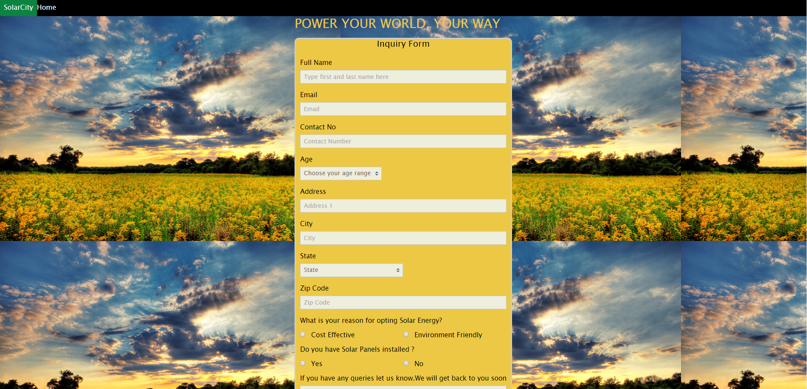

# SolarCity

# Problem Statement
Single Page Application to accept a customer's name, age, address, and why their interested in Solar (Yes/no questions and/or text.)  for Solar Online Sales.

# Solution 
Developed a  Responsive Single Page Full Stack Application with a form for the users to fill up,which is in-turn stored in the database.
The user Input is validated and then stored in the database.

## Technical Track
Full Stack Development

## Tech Used
* View Layer - React  (Experience Level - Beginner)
* Back End   - Node JS (Experience level - Intermediate)
* Database   - Mysql (Experience level - Intermediate)

## Running locally
```
On the Command Line install the Database
* mysql -p -u[user] < solarcity_contactinfo.sql

git clone git@github.com:manikajan123/SolarCity.git
cd SolarCity
npm i

Change the database credentials in the server.js file i.e user and password for mysql database.

cd client
npm i

cd ..
npm start
```

## Libraries Used
* spectre.css  - Cleaner and better UI

## To Do
* Deploy on Google App Enggine with Scaling
* Server side form Validation
* Prevent Duplicate submissions
* Ensure Security

## View


## Links
 [Code-Proud Of](https://github.com/manikajan123/Social_Networking_Academia) 


